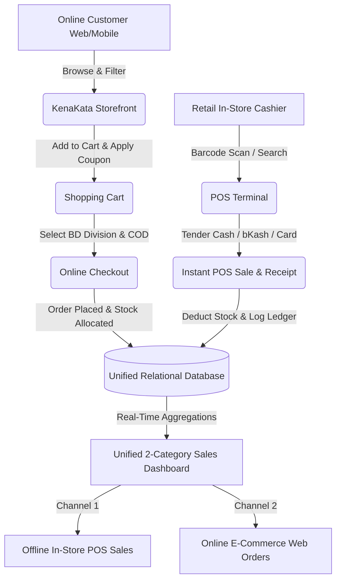

# KenaKata (কেনাকাটা) 🇧🇩🛍️

> **Bangladesh's Premier E-Commerce Marketplace & Unified Retail Point-of-Sale (POS) Ecosystem**

[](https://kenakata-o6l6.onrender.com/)
[](https://www.djangoproject.com/)
[](https://www.python.org/)
[](https://getbootstrap.com/)
[](https://www.postgresql.org/)
[](LICENSE)

---

## 🌟 1. Project Overview

**KenaKata** (developed under **SazzCommerce**) is a fully-featured, omnichannel e-commerce marketplace and integrated Point-of-Sale (POS) retail store system. It is uniquely tailored to resolve real-world retail challenges faced by businesses in Bangladesh.

### 🎯 The Core Problem & KenaKata's Solution
In traditional Bangladeshi retail, businesses typically manage two disconnected inventories: one for physical in-store customers and another for online website or Facebook orders. This leads to overselling, stock discrepancies, and poor financial tracking.

**KenaKata solves this by unifying offline retail cash registers and online customer orders into a single, real-time relational database.**
When a cashier completes a sale at the physical retail store using the barcode POS terminal, the inventory is immediately deducted from the online public marketplace, guaranteeing 100% stock accuracy.

### ✨ Unique Bangladeshi Localizations:
* **Native BDT (৳) Currency Handling**: All pricing, discounts, receipts, and revenue ledgers are formatted in Bangladeshi Taka.
* **Universal Multi-Method Login**: Customers can seamlessly sign in or register using their **Username**, **Gmail/Email**, or **Bangladeshi Mobile Number** (e.g., `01XXXXXXXXX`). The backend uses regex to validate BD mobile numbers natively.
* **Division-Based Cash on Delivery (COD)**: Automated shipping rates across all 8 administrative divisions (Inside Dhaka ৳60 vs. Outside Dhaka ৳120).

---

## 🌐 2. Live URLs & Access Matrix

**Live Production URL**: [https://kenakata-o6l6.onrender.com/](https://kenakata-o6l6.onrender.com/)

### 🛡️ Admin & Staff Portals (Back-Office & POS Terminal)
| Portal / Feature | Direct URL Path | Description & Capabilities |
| :--- | :--- | :--- |
| **Django Administration** | [`/admin/`](https://kenakata-o6l6.onrender.com/admin/) | Complete back-office control over users, inventory, and database schema |
| **POS Cashier Terminal** | [`/pos/terminal/`](https://kenakata-o6l6.onrender.com/pos/terminal/) | High-speed barcode scanning, cashier checkout, and thermal receipts |
| **Sales History & Analytics** | [`/pos/sales/`](https://kenakata-o6l6.onrender.com/pos/sales/) | 2-Category Sales Breakdown (**Offline POS** vs. **Online Web**) with revenue KPIs |
| **Inventory Manager** | [`/pos/products/`](https://kenakata-o6l6.onrender.com/pos/products/) | Manage SKUs, pricing, stock levels, and real-time inventory adjustments |
| **Store Settings** | [`/pos/settings/`](https://kenakata-o6l6.onrender.com/pos/settings/) | Cash drawer management, VAT rates, and low stock thresholds |

#### 🔑 Ready-to-Use Demo Login Credentials:
You can log in at [`/auth/login/`](https://kenakata-o6l6.onrender.com/auth/login/) or [`/admin/`](https://kenakata-o6l6.onrender.com/admin/) using either **Username**, **Email**, or **Mobile**:

| Role / Access Level | Username / Email | Password | Permissions & Capabilities |
| :--- | :--- | :--- | :--- |
| **👑 Super Admin / Owner** | `admin` or `admin@kenakata.com` | `admin1234` | Full Django Admin (`/admin/`), POS Terminal, Inventory, Sales Analytics & Settings |
| **🏪 Store Staff / Cashier** | `staff` or `staff@kenakata.com` | `staff1234` | POS Barcode Terminal (`/pos/terminal/`), Cashier Register, Online/Offline Orders |
| **🛍️ Customer / Buyer** | `customer` or `customer@kenakata.com` | `customer1234` | Storefront, Cart, Checkout, Wishlist, Order History & Address Book |

---

### 🛍️ Customer & Public Portals (Storefront)
| Portal / Feature | Direct URL Path | Description & Capabilities |
| :--- | :--- | :--- |
| **Marketplace Storefront** | [`/`](https://kenakata-o6l6.onrender.com/) | Homepage, Dynamic Hero Slider, Flash Deals, and Categories |
| **Product Catalog** | [`/shop/`](https://kenakata-o6l6.onrender.com/shop/) | Search query parser, price range sliders, and multi-category filters |
| **Shopping Cart** | [`/cart/`](https://kenakata-o6l6.onrender.com/cart/) | Session-backed cart, quantity adjustments, and dynamic coupon engine |
| **Checkout** | [`/checkout/`](https://kenakata-o6l6.onrender.com/checkout/) | 8 BD divisions selector, shipping calculations, and order finalization |
| **Customer Dashboard** | [`/account/`](https://kenakata-o6l6.onrender.com/account/) | Order status tracking (`Pending`, `Delivered`), history, and address book |
| **Authentication** | [`/auth/login/`](https://kenakata-o6l6.onrender.com/auth/login/) | Login using Username, Email, or BD Mobile |

#### 🎟️ Active Demo Promo Coupons:
* `EID2026` — **20% Off** on orders over ৳3,000
* `BDDEAL` — **15% Off** on orders over ৳2,000
* `HACKATHON10` — **10% Off** on orders over ৳500
* `WELCOME100` — **৳100 Flat Discount** on orders over ৳1,000

---

## 🏗️ 3. Platform Architecture & Data Flow

KenaKata’s architecture bridges physical retail and online commerce into a unified ledger.



---

## ✨ 4. Core Features & Module Breakdown

### 🏬 Core Commerce Features (Online Store)
* **Hierarchical Category Engine**: Robust taxonomy supporting 30+ categories/subcategories (Electronics, Fashion, Groceries, etc.).
* **Intelligent Product Imagery**: Native integration of Unsplash CDNs alongside branded vector placeholders (`placeholder.svg`) ensuring robust, unbreakable image rendering.
* **Coupon & Discount Engine**: Rule-based discounts (Percentage or Fixed amount) bounded by minimum spend requirements and maximum limit caps.
* **Resilient Order Tracking**: Zero-404 order confirmation system with real-time UI tracking steps (`Pending`, `Packed`, `Out for Delivery`).
* **Customer Wishlist & Reviews**: Star rating system with verified-purchaser constraints and one-click 'Add to Cart' from saved wishlists.

### 🏢 Merchant Point-of-Sale (POS)
* **High-Speed Thermal Receipts**: Beautifully crafted receipts optimized for 80mm thermal printers. Dark-mode on screen, auto high-contrast black-on-white for physical print.
* **Cashier Workflow Optimization**: Keyboard shortcuts, barcode scanning support, and instant change/tender calculations.
* **Payment Multi-Gateway Simulator**: Logs transactions via `CASH`, `BKASH`, `NAGAD`, and `CARD` logic flows.
* **Inventory Movement Ledger**: Immutable audit trail logging restocks, POS deductions, and online order fulfillment.
* **Advanced Financial Dashboard**: Granular metrics splitting net sales, gross revenue, discounts, and units sold between the physical store and the web storefront.

---

## 🛠️ 5. Tech Stack & Software Architecture

| Architecture Layer | Technologies |
| :--- | :--- |
| **Backend Framework** | Python 3.10+, Django 5.0+ |
| **Database** | SQLite 3 (Local Development) & PostgreSQL via `dj-database-url` (Production) |
| **Frontend UI/UX** | HTML5, Vanilla CSS3 (Custom Glassmorphism), Bootstrap 5.3, Bootstrap Icons |
| **Static & Assets** | WhiteNoise 6.6+ (Gzip / Brotli compression and infinite cache headers) |
| **Web Server** | Gunicorn 21.2+ (WSGI Server) |
| **Deployment Infrastructure**| Render.com (PaaS), Blueprint YAML configurations |

---

## 📁 6. Django App Directory Structure

The monolith is organized into 9 highly cohesive, decoupled Django apps:

```text
kenakata/
├── accounts/          # User authentication logic, UserProfile, Bangladesh mobile validation
├── cart/              # Cart & CartItem models, session storage synchronization, Coupon logic
├── catalog/           # Products, Brands, Categories, and database seed scripts
├── core/              # Global context processors, homepage views, and custom error handlers
├── dashboard/         # End-user customer portal (Order tracking, Reviews, Address book)
├── orders/            # Online Checkout processing, COD fulfillment, OrderItem generation
├── pos/               # Cashier POS Terminal, Sales Analytics Dashboard, Inventory Ledger
├── reviews/           # Product star ratings and verified purchaser verification logic
├── wishlist/          # Saved customer favorites
├── sazzcommerce/      # Main settings.py, WSGI bootloader, and Root URLs
├── static/            # CSS Design System (base.css), Custom JS, SVG assets
├── templates/         # 40+ modular Jinja2 HTML templates across all apps
├── build.sh           # Automated Render.com deployment script (migrations & collectstatic)
├── render.yaml        # Render Infrastructure-as-Code Blueprint
└── requirements.txt   # Core Python dependencies
```

---

## 🚀 7. Local Development & Quickstart

### Prerequisites
* [Python 3.10+](https://www.python.org/downloads/)
* Git

### Step-by-Step Installation

1. **Clone the Repository**
   ```bash
   git clone https://github.com/sazzadhossainsakib13/kenakata.git
   cd kenakata
   ```

2. **Create & Activate Virtual Environment**
   ```bash
   # Windows (PowerShell)
   python -m venv venv
   .\venv\Scripts\activate

   # Linux / macOS
   python3 -m venv venv
   source venv/bin/activate
   ```

3. **Install Dependencies**
   ```bash
   pip install -r requirements.txt
   ```

4. **Initialize Database & Seed Initial Catalog**
   KenaKata includes a robust data seeder that populates categories, products, images, and demo accounts.
   ```bash
   python manage.py makemigrations
   python manage.py migrate
   python manage.py seed_data
   ```

5. **Start Local Development Server**
   ```bash
   python manage.py runserver
   ```

6. **Access Locally**
   - Public Storefront: `http://127.0.0.1:8000/`
   - Admin Back-Office: `http://127.0.0.1:8000/admin/` (Login: `admin` / `admin1234`)
   - POS Terminal: `http://127.0.0.1:8000/pos/terminal/`

---

## ☁️ 8. Cloud Production Deployment (Render.com)

KenaKata is production-ready for deployment on Render.com utilizing Gunicorn, WhiteNoise, and PostgreSQL.

1. Fork or push this repository to your GitHub account.
2. Sign in to [Render.com](https://render.com/) and create a **New Web Service**.
3. Connect your `kenakata` GitHub repository.
4. Configure service parameters:
   - **Environment**: `Python 3`
   - **Build Command**: `./build.sh`
   - **Start Command**: `gunicorn sazzcommerce.wsgi:application`
5. (Optional but Recommended) Under **Environment Variables**, add `DATABASE_URL` pointing to a PostgreSQL instance. If omitted, KenaKata safely falls back to local SQLite.
6. Click **Create Web Service**. Render will execute the build script, collect static assets, seed the database, and launch the application.

---

## 🔒 9. Security & Architecture Best Practices

* **Robust Parameterization**: 100% ORM integration prevents SQL Injection vectors.
* **Atomic Transactions**: Critical flows like Checkout and POS Sales are wrapped in `transaction.atomic` to guarantee data integrity across inventory deductions and order creation.
* **CSRF Protection**: Native Django CSRF tokens validate all form submissions globally.
* **Password Hashing**: Cryptographically secure PBKDF2 with SHA-256 password hashing.
* **Template Resilience**: Deep integration of graceful degradation with robust `get_object_or_404` and session fallbacks ensuring zero 500/404 errors on missing resources.

---

## 👤 Author & Maintainer

**Sazzad Hossain Sakib**
* GitHub: [@sazzadhossainsakib13](https://github.com/sazzadhossainsakib13)

---

## 📄 License

This project is licensed under the MIT License — see the [LICENSE](LICENSE) file for details.
