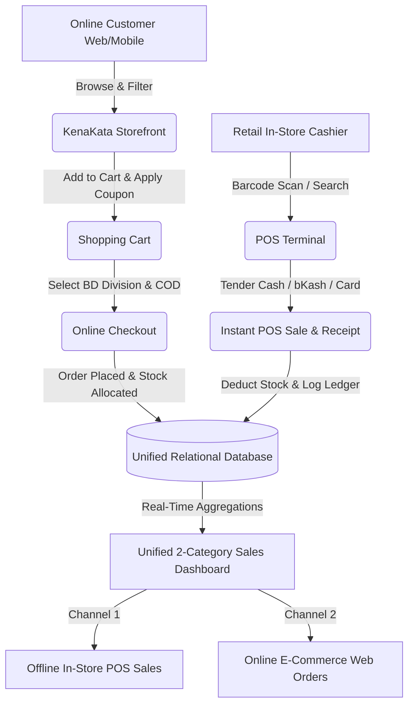

# KenaKata (কেনাকাটা) 🇧🇩🛍️

> **Bangladesh's Premier E-Commerce Marketplace & Unified Retail Point-of-Sale (POS) Ecosystem**

[](https://kenakata-o6l6.onrender.com/)
[](https://www.djangoproject.com/)
[](https://www.python.org/)
[](https://getbootstrap.com/)
[](https://www.postgresql.org/)
[](LICENSE)

---

## 🌟 1. Project Overview

**KenaKata** (developed under **SazzCommerce**) is an enterprise-grade, omnichannel e-commerce marketplace and integrated Point-of-Sale (POS) retail store system specifically tailored for the Bangladeshi retail ecosystem.

In traditional retail, businesses in Bangladesh struggle with disconnected operations—maintaining one inventory for physical in-store counters and another for online Facebook/website orders. **KenaKata solves this by unifying offline retail cash registers and online customer orders into a single, real-time relational SQL database.**

### 🎯 Key Objectives & Solutions:
1. **Unified Omnichannel Operations**: When a product is sold in a physical retail outlet via the barcode POS terminal, stock is automatically and instantly deducted from the public online marketplace, preventing overselling.
2. **Tailored for Bangladesh**:
   - **Local Currency & Formatting**: Native **BDT (৳)** currency handling across catalogs, carts, orders, and receipts.
   - **Multi-Method Authentication**: Customers can sign up and log in using their **Username**, **Gmail/Email**, or **Bangladeshi Mobile Number (`01XXXXXXXXX`)**.
   - **Division-Based Cash on Delivery (COD)**: Automated shipping rates (Inside Dhaka ৳60 vs Outside Dhaka ৳120 across all 8 administrative divisions).
3. **Dual-Category Sales Ledger**: Financial reporting clearly separates revenue into **Offline POS Cash Register Sales** and **Online Web Store Orders** with itemized gross revenue, discounts, returns, and inventory audits.
4. **Thermal Receipt & Invoice Engine**: Real-time printable thermal receipt generation (`/pos/receipt/<receipt_number>/`) formatted for 80mm POS receipt printers as well as online customer packing slips.

---

## 🌐 2. Live URLs & Access Matrix

**Live Production URL**: [https://kenakata-o6l6.onrender.com/](https://kenakata-o6l6.onrender.com/)

### 🛡️ Admin & Staff Portals (Back-Office & POS Terminal)

| Portal / Feature | Direct URL Path | Description & Capabilities |
| :--- | :--- | :--- |
| **Django Administration** | [`/admin/`](https://kenakata-o6l6.onrender.com/admin/) | Full database control over orders, products, inventory, users, and hero banners |
| **POS Cashier Terminal** | [`/pos/terminal/`](https://kenakata-o6l6.onrender.com/pos/terminal/) | Fast in-store barcode scanning, stock validation, cashier tender, and thermal receipts |
| **Sales History & Analytics** | [`/pos/sales/`](https://kenakata-o6l6.onrender.com/pos/sales/) | 2-Category Sales Breakdown (**Offline POS Sales** vs. **Online Web Orders**) with revenue metrics |
| **Inventory & Products** | [`/pos/products/`](https://kenakata-o6l6.onrender.com/pos/products/) | SKU & Barcode management, inventory ledger, pricing, and stock additions |
| **Store Settings & Cash Drawer** | [`/pos/settings/`](https://kenakata-o6l6.onrender.com/pos/settings/) | Cash register opening/closing sessions, VAT tax rates, low stock alert thresholds |

#### 🔑 Superuser Credentials:
* **Username / Email**: `admin` or `admin@kenakata.com`
* **Password**: `admin1234`

---

### 🛍️ Customer & Public Portals (Storefront & Checkout)

| Portal / Feature | Direct URL Path | Description & Capabilities |
| :--- | :--- | :--- |
| **Marketplace Storefront** | [`/`](https://kenakata-o6l6.onrender.com/) | Homepage, Hero Slider, Flash Deals, Trending Products & Category Grid |
| **Product Catalog & Search** | [`/shop/`](https://kenakata-o6l6.onrender.com/shop/) | Search query parser, price range sliders, multi-category & brand filters |
| **Shopping Cart** | [`/cart/`](https://kenakata-o6l6.onrender.com/cart/) | Session-backed cart, quantity adjustments, and dynamic coupon discount engine |
| **Cash on Delivery Checkout** | [`/checkout/`](https://kenakata-o6l6.onrender.com/checkout/) | 8 Bangladesh divisions selector, Dhaka vs. Outside Dhaka shipping calculation |
| **Customer Dashboard** | [`/account/`](https://kenakata-o6l6.onrender.com/account/) | Order status tracking (`Pending`, `Processing`, `Delivered`), receipts & address book |
| **Saved Wishlist** | [`/wishlist/`](https://kenakata-o6l6.onrender.com/wishlist/) | Customer favorite product bookmarks with one-click Add to Cart |
| **Universal Login** | [`/auth/login/`](https://kenakata-o6l6.onrender.com/auth/login/) | Login seamlessly using **Username**, **Gmail/Email**, or **Mobile Number** |
| **Account Registration** | [`/auth/register/`](https://kenakata-o6l6.onrender.com/auth/register/) | Instant new customer registration with Bangladesh mobile number validation |

#### 🎟️ Active Demo Promo Coupons:
* `EID2026` — **20% Off** on orders over ৳3,000 (Max discount ৳2,000)
* `BDDEAL` — **15% Off** on orders over ৳2,000 (Max discount ৳500)
* `HACKATHON10` — **10% Off** on orders over ৳500 (Max discount ৳1,000)
* `WELCOME100` — **৳100 Flat Discount** on orders over ৳1,000

---

## 🏗️ 3. Platform Architecture & Data Flow



---

## ✨ 4. Detailed Feature Breakdown

### 🛒 A. Customer Storefront & Commerce
* **Hierarchical Category Engine**: Over 30 categories and subcategories (Electronics, Men's & Women's Fashion, Groceries, Sports & Lifestyle).
* **Smart Image Resolution**: High-resolution Unsplash CDN product photography coupled with branded vector SVG placeholders (`/static/images/placeholder.svg`) ensuring zero broken images.
* **Flexible Coupon Engine**: Supports percentage-based discounts and fixed-amount deductions with minimum spend thresholds and maximum discount caps.
* **Bangladeshi Delivery Matrix**:
  * **Inside Dhaka**: ৳60 delivery charge (Estimated 1–2 business days).
  * **Outside Dhaka**: ৳120 delivery charge (Estimated 3–5 business days across all 8 administrative divisions).
* **Customer Account Management**: Full order timeline, order history, downloadable summaries, and product review submissions.

### 🏢 B. Merchant Point-of-Sale (POS) Terminal
* **High-Speed Checkout**: Search products by name, SKU, or barcode with keyboard shortcut bindings.
* **Cashier Tender Flow**: Instant change calculation, discount overrides, and customer mobile attachment.
* **Multi-Payment Support**: Accepts `CASH`, `BKASH`, `NAGAD`, and `CARD`.
* **Inventory Movement Ledger**: Automatically logs inventory restocks, damaged stock write-offs, POS sales, and online order allocations.
* **Split Sales History Reporting**: Real-time sales metrics split cleanly into **Offline In-Store POS Sales** and **Online Web Store Orders**.

---

## 🛠️ 5. Tech Stack & Architectural Details

| Layer | Technologies Used |
| :--- | :--- |
| **Backend Framework** | Python 3.10+, Django 5.0+ |
| **Frontend UI** | Vanilla HTML5 & CSS3 (Custom Glassmorphism Design System), Bootstrap 5.3 |
| **Static & Media Asset Delivery** | WhiteNoise 6.6+ with Gzip / Brotli compression and cache headers |
| **Database Support** | SQLite 3 (Default Local / Ephemeral) & PostgreSQL via `DATABASE_URL` (Production) |
| **WSGI Server** | Gunicorn 21.2+ (Production Application Server) |
| **Localization & Standards** | BDT Currency (৳), `Asia/Dhaka` Timezone (GMT+6), Bangladeshi Mobile Regex |

---

## 📁 6. Directory & App Structure

```text
kenakata/
├── accounts/          # User authentication, UserProfile, and Bangladesh address model
├── cart/              # Cart & CartItem models, session synchronization, and Coupon engine
├── catalog/           # Category, Brand, Product, ProductSpecification, Banner & Seed scripts
├── core/              # Homepage view, global context processor, search & error handlers
├── dashboard/         # Customer account portal, recent orders, reviews & address management
├── orders/            # Checkout processing, COD fulfillment, and order tracking
├── pos/               # Cashier terminal, 2-category sales history, inventory ledger, settings
├── reviews/           # Product reviews, star ratings, and verified purchaser flags
├── sazzcommerce/      # Main settings.py, WSGI auto-boot seeding, and URL configurations
├── static/            # CSS Design System (base.css), JS scripts, and SVG placeholders
├── templates/         # 40+ modular templates (includes, core, catalog, pos, dashboard, orders)
├── wishlist/          # Saved customer wishlist items
├── build.sh           # Cloud build script (makemigrations, migrate, collectstatic, seed_data)
├── render.yaml        # Render.com Infrastructure-as-Code Blueprint
└── requirements.txt   # Core Python dependencies
```

---

## 🔀 7. Complete API & Route Map

| URL Path | View / Module | HTTP Methods | Access Level | Description |
| :--- | :--- | :---: | :---: | :--- |
| `/` | `core.views.home` | `GET` | Public | Homepage, banners, and flash sale grid |
| `/shop/` | `catalog.views.product_list` | `GET` | Public | Searchable and filterable product catalog |
| `/shop/<slug>/` | `catalog.views.product_detail` | `GET` | Public | Product specifications, gallery, and reviews |
| `/cart/` | `cart.views.cart_detail` | `GET` | Public | Active shopping cart overview |
| `/cart/add/<id>/` | `cart.views.add_to_cart` | `POST` | Public | Add item to cart with quantity selection |
| `/cart/apply-coupon/` | `cart.views.apply_coupon` | `POST` | Public | Validate and apply promo code |
| `/checkout/` | `orders.views.checkout` | `GET`, `POST` | Customer | Address entry & Cash on Delivery placement |
| `/checkout/order-confirmation/<order_number>/` | `orders.views.order_success` | `GET` | Customer / Public | Order confirmation and live tracking summary |
| `/account/` | `dashboard.views.home` | `GET` | Customer | Customer order history and profile stats |
| `/wishlist/` | `wishlist.views.wishlist_view`| `GET` | Customer | Saved wishlist bookmark collection |
| `/auth/login/` | `accounts.views.login_view` | `GET`, `POST` | Public | Multi-identifier login (Username/Gmail/Mobile)|
| `/auth/register/` | `accounts.views.register_view`| `GET`, `POST` | Public | Customer account registration |
| `/pos/terminal/` | `pos.views.terminal` | `GET`, `POST` | Staff / Admin| Cashier terminal and receipt checkout |
| `/pos/sales/` | `pos.views.sales_history` | `GET` | Staff / Admin| 2-Category Sales Breakdown (Offline vs. Online) |
| `/pos/receipt/<receipt_number>/` | `pos.views.receipt_detail` | `GET` | Staff / Admin| Universal thermal printable receipt & invoice |
| `/pos/products/` | `pos.views.products` | `GET`, `POST` | Staff / Admin| Stock manager and SKU barcode manager |
| `/admin/` | `django.contrib.admin` | `GET`, `POST` | Superuser | Complete Django administrative back-office |

---

## 🚀 8. Step-by-Step Local Setup

### Prerequisites
* [Python 3.10+](https://www.python.org/downloads/)
* [Git](https://git-scm.com/)

### Installation

1. **Clone the Repository**
   ```bash
   git clone https://github.com/sazzadhossainsakib13/kenakata.git
   cd kenakata
   ```

2. **Create and Activate Virtual Environment**
   ```bash
   # Windows (PowerShell)
   python -m venv venv
   .\venv\Scripts\activate

   # Linux / macOS
   python3 -m venv venv
   source venv/bin/activate
   ```

3. **Install Dependencies**
   ```bash
   pip install -r requirements.txt
   ```

4. **Initialize Database & Seed Catalog**
   ```bash
   python manage.py makemigrations
   python manage.py migrate
   python manage.py seed_data
   ```

5. **Start Local Development Server**
   ```bash
   python manage.py runserver
   ```

6. **Access In Browser**
   - Storefront: `http://127.0.0.1:8000/`
   - Admin Panel: `http://127.0.0.1:8000/admin/` (`admin` / `admin1234`)
   - POS Terminal: `http://127.0.0.1:8000/pos/terminal/`

---

## ☁️ 9. Cloud Production Deployment (Render.com)

1. Fork or push this repository to GitHub.
2. Sign in to [Render.com](https://render.com/) and create a **New Web Service**.
3. Select your `kenakata` repository.
4. Configure service parameters:
   - **Environment**: `Python 3`
   - **Region**: `Singapore` (or nearest region)
   - **Branch**: `main`
   - **Build Command**: `./build.sh`
   - **Start Command**: `gunicorn sazzcommerce.wsgi:application`
5. (Optional) Under **Environment Variables**, add `DATABASE_URL` pointing to your PostgreSQL instance.
6. Click **Create Web Service**. Render will execute migrations, collect static assets, seed the demo catalog, and start Gunicorn automatically.

---

## 🔒 10. Security & Architecture Best Practices

* **CSRF Protection**: All form submissions (Cart, Checkout, Authentication, POS) require Django CSRF tokens.
* **SQL Injection Prevention**: 100% parameterization through Django ORM with atomic transaction safety (`transaction.atomic`).
* **Multi-Format Password Hashing**: Passwords hashed securely using PBKDF2 with SHA-256.
* **Production Static Serving**: Optimized static asset delivery through WhiteNoise with cache headers.

---

## 👤 Author & Maintainer

**Sazzad Hossain Sakib**
* GitHub: [@sazzadhossainsakib13](https://github.com/sazzadhossainsakib13)

---

## 📄 License

This project is licensed under the MIT License — see the [LICENSE](LICENSE) file for details.
